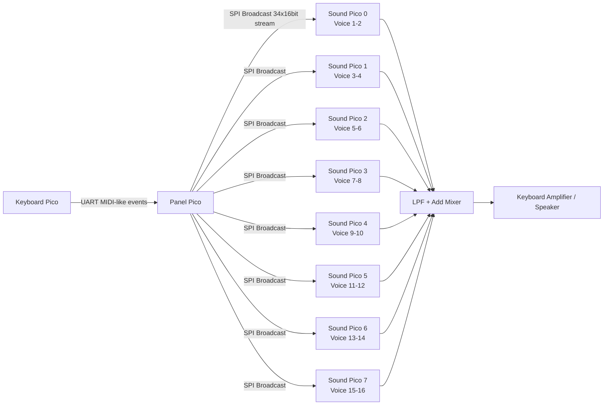

# 34_pico_synth

Raspberry Pi Pico（RP2040）を複数台連携させて、電子ピアノをポリフォニック・シンセサイザー化するプロジェクトです。  
本リポジトリは、既存実装を `old/` に退避したうえで、段階的リファクタリングにより新アーキテクチャへ移行していきます。

---

## 1. このプロジェクトが目指すもの

- 低コストな構成で、16ボイス同時発音のシンセを構築
- キーボード入力、パネル操作、発音処理をマルチPicoで分散処理
- RP2040のハードウェア機能（PWM / SPI / 割り込み / マルチコア）を最大限活用
- 将来的に保守性と性能を両立したコードベースへ再構築

---

## 2. ハードウェア構成

### 2.1 使用するRP2040ボード総数

- Raspberry Pi Pico 合計 **10台**
  - **Keyboard用**: 1台
  - **Panel用（メイン制御）**: 1台
  - **Sound用（発音）**: 8台

### 2.2 各ボードの役割

#### Keyboard（1台）
- 76鍵キーボード行列を走査
- サステインペダル状態を検出
- ノートイベントをUARTでPanelへ送信

#### Panel（1台）
- UARTでKeyboardイベントを受信
- ノブ/スイッチの状態をADC・GPIOから取得
- 16ボイス分の割り当てを管理
- 全SoundボードへSPIで制御データをブロードキャスト

#### Sound（8台）
- 各ボードが2ボイス分を担当（計16ボイス）
- SPIで受信した全体制御データから自分の担当ボイスのみ抽出
- VCO/VCF/VCA/EGに基づいて音声生成
- PWM出力をアナログLPFで平滑化し、加算回路へ出力

### 2.3 接続方式（重要）

- **Panel → Sound のSPI配線はバス共有**
- SPI信号線は全Soundボードへ**並列接続**
- 制御データは**全ボイス情報を含むブロードキャスト**
- 音声は各SoundボードのPWM出力をLPF後に**シンプルな加算回路**で合成

---

## 3. システムアーキテクチャ図

```text
┌─────────────────────────────────────────────────────────────┐
│                    Broadcast型 Synth System                 │
└─────────────────────────────────────────────────────────────┘

[Keyboard Unit] --UART--> [Panel Unit]
                           │
                           │ SPI Master (shared bus)
                           │ SCK / MOSI / CS を全Soundへ並列配線
                           │
        ┌──────────────────┼──────────────────┐
        │                  │                  │
        ▼                  ▼                  ▼
     [Sound0]           [Sound1]          ... [Sound7]
     (Voice1,2)         (Voice3,4)           (Voice15,16)
        │                  │                  │
      PWM L/R            PWM L/R            PWM L/R
        └──────────────────┴──────────────────┘
                           │
                    [LPF + Add Mixer]
                           │
                     [Piano Amp / Speaker]
```



---

## 4. 音源処理の論理構成

1ボイスは概ね次のチェーンで構成されます。

- VCO1 + VCO2（Saw/Sine/Triangle/Square）
- Mix
- VCF（LPF / HPF, Cutoff, Resonance）
- VCA（Gain）
- ADSR Envelope（VCF用・VCA用）

将来的には以下を順次実装・強化予定です。

- LFO（ターゲット選択付き）
- Pan
- Noise波形
- より厳密なプロトコル定義とエラーハンドリング

---

## 5. ソース構成（現在）

現在は移行初期段階のため、既存実装は `old/` に保持しています。

```text
34_pico_synth/
├── LICENSE
├── README.md          <- このファイル
└── old/
    ├── README.md
    ├── ltspice_sim/
    ├── pico-synth-keyboard/
    ├── pico-synth-panel/
    └── pico-synth-sound/
```

### old/pico-synth-keyboard/
- `pico-synth-keyboard.c`: キーボード走査とUART/USB MIDI送信
- `usb_descriptors.c`, `tusb_config.h`: TinyUSB設定
- `note_index.csv`: キー割り当て関連データ

### old/pico-synth-panel/
- `pico-synth-panel.cpp`: メイン制御・ボイス割り当て
- `spi_mcp3008.*`: ADC読み取り
- `spi_74hc595.*`: LED用シフトレジスタ制御
- `spi_device.*`: SPIデバイス共通処理
- `selector.hpp`: UI選択ロジック

### old/pico-synth-sound/
- `pico-synth-sound.cpp`: 音声生成メイン
- `voice.*`: 1ボイス合成ロジック
- `oscillator.*`: オシレータ
- `filter.*`: フィルタ
- `envelope_generator.*`: ADSR
- `fixed_point.hpp`: 固定小数点演算
- `table_wave_auto.h`, `table_wave.py`: 波形テーブル
- `table_freq.csv`: ノート周波数テーブル

---

## 6. 新プロジェクトの目標構成（段階的移行先）

```text
34_pico_synth/
├── common/         # プロトコル定義・共通型・共通設定
├── dsp/            # oscillator/filter/envelope/voice 等
├── keyboard/       # keyboard firmware
├── panel/          # panel firmware
├── sound/          # sound firmware（8バイナリ）
├── tests/          # PC上でのロジック検証
├── docs/           # protocol / architecture / hardware
└── old/            # 旧実装アーカイブ（参照専用）
```

> 方針: `old/` を参照しつつ、新規コードはルート直下の新構成へ段階移行する。

---

## 7. 重要な実装ポリシー

- まず動作・音質を維持しつつ、モジュール単位で置き換える
- ハードウェア依存最適化（RP2040特化）は残す
- ただしプロトコル仕様・責務分離・テスト容易性を改善する
- 「全部一気に作り直す」のではなく、可動状態を保って漸進移行する

---

## 8. 現在のステータス

- [x] 既存コードを `old/` へ退避
- [x] 新プロジェクトルートを再定義
- [ ] 共通プロトコル定義（`common/`）
- [ ] DSPコアの再配置（`dsp/`）
- [ ] keyboard / panel / sound の新構成化
- [ ] 統合テストと性能評価

このREADMEは、実装の進行に合わせて更新していきます。
