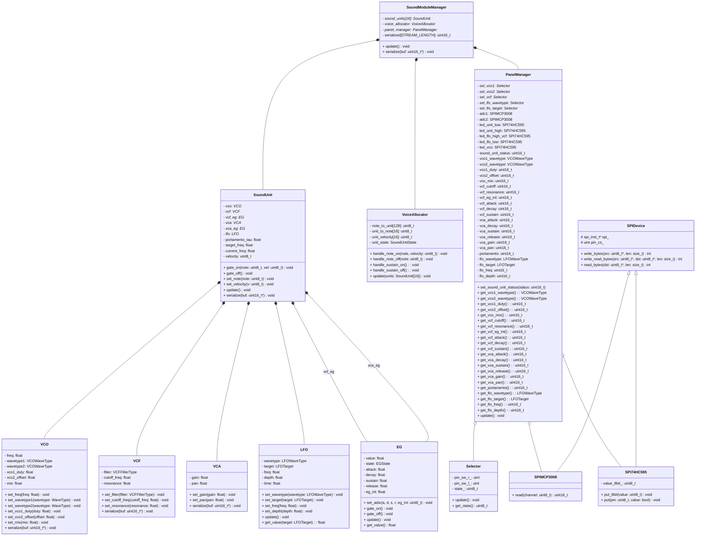

# Panel Module (pico-synth-panel)

Panel モジュールは、Keyboard から受け取った MIDI イベントをもとに 16 ボイス（8 台の Sound Pico × 2 ボイス）の割り当てを管理し、Sound 全台へ音声パラメータを SPI ブロードキャストする中核的な制御ユニットです。


---

## 概要

**主な機能：**
- **UART MIDI 受信**: Keyboard からの MIDI Note On/Off イベント受信（115200 bps）、ノンブロッキング処理
- **Voice Allocation**: 最大 16 ボイスの割り当て管理、Round-robin 割り当て、Voice stealing、Sustain Pedal 対応
- **UI 入力**: 5 種類のセレクタスイッチ（VCO1/VCO2 波形、VCF タイプ、LFO 波形/ターゲット）
- **ADC 入力**: 16 個のポテンショメータから Synth パラメータ値を読み込み（MCP3008 × 2）
- **LED 制御**: 74HC595 シフトレジスタでボイス状態とモード表示
- **SPI 送信**: 8 台の Sound モジュールにパラメータストリームをブロードキャスト

---

## ハードウェア

### プロセッサ
- RP2040（シングルコア実装）

### 通信インターフェース
- **UART**: Keyboard MIDI 受信（115200 bps）
- **SPI Panel (spi0)**: ADC/LED 制御（1 MHz）
- **SPI Sound (spi1)**: Sound ブロードキャスト（1 MHz）

### アナログ入力
- **MCP3008 × 2**: 合計 16 チャンネルのアナログ入力（ポテンショメータ）

### デジタル出力
- **74HC595 × 5**: シフトレジスタ LED 制御

### ユーザーインターフェース
- **スイッチ**: 5 種類 × R/L ボタン = 10 個（GPIO）

### ピン配置

```
UART (MIDI 受信):
  TX: GPIO0 (出力、使用せず)
  RX: GPIO1 (入力：Keyboard から)

SPI Panel (spi0) - ADC/LED 制御:
  SCK:  GPIO18
  MOSI: GPIO19
  MISO: GPIO16
  CS ADC1:         GPIO7
  CS ADC2:         GPIO8
  CS SR Unit Low:  GPIO2
  CS SR LFO VCF:   GPIO3
  CS SR LFO Low:   GPIO4
  CS SR Unit High: GPIO5
  CS SR VCO:       GPIO6

SPI Sound (spi1) - ブロードキャスト:
  SCK:  GPIO14
  MOSI: GPIO15
  MISO: GPIO12
  CS:   GPIO13

UI スイッチ:
  VCO1:      GPIO29 (R), GPIO28 (L)
  VCO2:      GPIO27 (R), GPIO26 (L)
  VCF:       GPIO25 (R), GPIO24 (L)
  LFO Wave:  GPIO23 (R), GPIO22 (L)
  LFO Target:GPIO21 (R), GPIO20 (L)
```

---

### ハードウェア割り当て詳細

#### スイッチ (SW) - UI セレクタ

| スイッチ | GPIO | 機能 | 状態数 | 説明 |
|---------|------|------|--------|------|
| **VCO1** | 29(R), 28(L) | VCO1 波形選択 | 4 | Saw, Sin, Tri, Square |
| **VCO2** | 27(R), 26(L) | VCO2 波形選択 | 4 | Saw, Sin, Tri, Square |
| **VCF** | 25(R), 24(L) | フィルタタイプ | 2 | LPF, HPF |
| **LFO Wave** | 23(R), 22(L) | LFO 波形選択 | 6 | Saw↑, Saw↓, Sin, Tri, Square, Random |
| **LFO Target** | 21(R), 20(L) | LFO 変調ターゲット | 6 | VCO1Pitch, VCO2Duty, VCOMix, VCFCutoff, VCAGain, VCAPan |

**操作**: 右ボタン (R) で選択肢を進む、左ボタン (L) で選択肢を戻す


#### ポテンショメータ (VR) - ADC 入力割り当て

##### ADC1 (MCP3008 #1) - 8チャンネル

| CH | GPIO CS | 機能 | 説明 |
|----|---------|------|------|
| 0 | 7 | **VCF CutOff** | フィルタ遮断周波数（20Hz～20kHz） |
| 1 | 7 | **VCO Mix** | VCO1/VCO2 ミックスバランス |
| 2 | 7 | **VCO Duty** | PWM デューティ（パルス幅調整） |
| 3 | 7 | **VCO2 Tune** | VCO2 チューニング（±1 octave） |
| 4 | 7 | **VCF Decay** | フィルタ EG ディケイタイム |
| 5 | 7 | **VCF Attack** | フィルタ EG アタックタイム |
| 6 | 7 | **VCF EG Int** | フィルタ EG 強さ |
| 7 | 7 | **VCF Resonance** | フィルタレゾナンス (Q)「ピーク」 |

##### ADC2 (MCP3008 #2) - 8チャンネル

| CH | GPIO CS | 機能 | 説明 |
|----|---------|------|------|
| 0 | 8 | **LFO Depth** | LFO変調デプス（変調深さ） |
| 1 | 8 | **LFO Speed** | LFO速度（周波数） |
| 2 | 8 | **Portamento** | ポルタメント |
| 3 | 8 | **VCA Release** | 音量 EG リリースタイム |
| 4 | 8 | **VCA Sustain** | 音量 EG サスティンレベル |
| 5 | 8 | **VCA Decay** | 音量 EG デケイタイム |
| 6 | 8 | **VCA Attack** | 音量 EG アタックタイム |
| 7 | 8 | **VCF Sustain** | フィルタ EG サスティンレベル |


#### LED - シフトレジスタ (74HC595) 割り当て

| シフトレジスタ | GPIO CS | 機能 | LED数 | 説明 |
|---------------|---------|------|-------|------|
| **SR_UNIT_LOW** | 2 | ユニット 0-7 状態表示 | 8 | Unit 0-7 が発音中かを表示 |
| **SR_UNIT_HIGH** | 5 | ユニット 8-15 状態表示 | 8 | Unit 8-15 が発音中かを表示 |
| **SR_VCO** | 6 | VCO1/VCO2 波形 LED | 8 | 選択中の VCO1/VCO2 波形 を表示 |
| **SR_LFO_HIGH_VCF** | 3 | LFO波形・VCFモード LED | 8 | LFO 波形・VCF タイプを表示 |
| **SR_LFO_LOW** | 4 | LFO ターゲット LED | 8 | LFO 変調ターゲットを表示 |

##### 詳細ビット割り当て

###### SR_UNIT_LOW (Pin: CS2, Unit 8-15 状態)
| Bit | 7 | 6 | 5 | 4 | 3 | 2 | 1 | 0 |
|-----|---|---|---|---|---|---|---|---|
| Unit| 15| 14| 13| 12| 11| 10| 9 | 8 |

###### SR_UNIT_HIGH (Pin: CS5, Unit 0-7 状態)
| Bit | 7 | 6 | 5 | 4 | 3 | 2 | 1 | 0 |
|-----|---|---|---|---|---|---|---|---|
| Unit| 7 | 6 | 5 | 4 | 3 | 2 | 1 | 0 |

###### SR_VCO (Pin: CS6, VCO1/VCO2 波形選択)
| Bit | 7 | 6 | 5 | 4 | 3 | 2 | 1 | 0 |
|-----|---|---|---|---|---|---|---|---|
| 機能| VCO2 Tri | VCO2 Sin | VCO2 Saw | VCO1 Square | VCO1 Tri | VCO1 Sin | VCO1 Saw | VCO2 Square |
| LED Pin| 7 | 6 | 5 | 4 | 3 | 2 | 1 | 0 |

###### SR_LFO_HIGH_VCF (Pin: CS3, VCF + LFO 波形)
| Bit | 7 | 6 | 5 | 4 | 3 | 2 | 1 | 0 |
|-----|---|---|---|---|---|---|---|---|
| 機能| VCF LPF | LFO Random | LFO Square | LFO Tri | LFO Sin | LFO Saw↓ | LFO Saw↑ | VCF HPF |
| 波形| LPF | Random | Square | Tri | Sin | Saw↓ | Saw↑ | HPF |
| LED Pin| 7 | 6 | 5 | 4 | 3 | 2 | 1 | 0 |

###### SR_LFO_LOW (Pin: CS4, LFO ターゲット)
| Bit | 7 | 6 | 5 | 4 | 3 | 2 | 1 | 0 |
|-----|---|---|---|---|---|---|---|---|
| 機能| 予備 | VCAPan | VCAGain | VCFCutoff | VCOMix | VCO2Duty | VCO1Pitch | 予備 |
| ターゲット| - | Pan | Gain | Cutoff | Mix | Duty | Pitch | - |
| LED Pin| 7 | 6 | 5 | 4 | 3 | 2 | 1 | 0 |

---

## SPI Sound モジュールへのデータ構造

Panel から Sound モジュール群へ SPI1 経由で送信されるデータフォーマット。  
各フレームで異なる Sound Unit（0-15）へのパラメータセットを送信します。

### フォーマット（16-bit 値 12 個 / Unit）

| インデックス | パラメータ | 範囲 | 説明 |
|------------|----------|------|------|
| **0** | **Destination Unit** | 0-15 | 宛先 Sound Unit |
| **1** | **VCO Freq** | 0-65535 | VCO 周波数 (Hz) |
| **2** | **VCO1 WaveType** | 0-3 | VCO1 波形 (Saw/Sin/Tri/Square) |
| **3** | **VCO2 WaveType** | 0-3 | VCO2 波形 (Saw/Sin/Tri/Square) |
| **4** | **VCO1 Duty** | 0-65535 | PWM デューティサイクル |
| **5** | **VCO2 Offset** | -32768～32767 | VCO2 チューニングオフセット (Hz) |
| **6** | **VCO Mix** | 0-65535 | VCO1/VCO2 ミックスバランス |
| **7** | **VCF Type** | 0-1 | フィルタタイプ (0=LPF, 1=HPF) |
| **8** | **VCF Cutoff** | 0-65535 | フィルタ遮断周波数 (Hz) |
| **9** | **VCF Resonance** | 0-65535 | フィルタレゾナンス (Q: 1/√2～4) |
| **10** | **VCA Gain Left** | 0-65535 | 左チャンネル ゲイン (0.0～1.0) |
| **11** | **VCA Gain Right** | 0-65535 | 右チャンネル ゲイン (0.0～1.0) |

### 送信プロトコル

- **総データ数**: 16 Unit × 12 値 = 192 ワード
- **フレーム間隔**: Core1 ループサイクル毎（毎フレーム各 Unit へ個別パラメータを送信）
- **Unit ID マッチング**: 各 Sound Unit は Index 0 の値をチェックして、自身の ID に一致した場合のみ処理

各 Unit は自身の Unit ID をチェックして、異なる ID パラメータは無視します。

---

## UART MIDI プロトコル
keyboardモジュールからの鍵盤情報の受信は，UART経由のMIDIで行う．

### フォーマット

- **Baud Rate**: 115200 bps
- **形式**: ASCII hex ("90 3c 7f\n")
- **方向**: Receive only

### メッセージタイプ

| メッセージ | Status | Data1 | Data2 | 説明 |
|-----------|--------|-------|-------|------|
| Note On | 0x90 | Note (0-127) | Velocity (1-127) | 鍵盤押下 |
| Note Off | 0x80 | Note (0-127) | 0 | 鍵盤リリース |
| Note Off | 0x90 | Note (0-127) | 0 | Note On with V=0 |
| Sustain Pedal | 0xB0 | 0x40 | 0-127 | CC 64 (≥64 = ON) |

---

## SPI Sound モジュールへのデータ構造

Panel から Sound モジュール群へ SPI1 経由で送信されるデータフォーマット。  
各フレームで異なる Sound Unit（0-15）へのパラメータセットを送信します。

### フォーマット（16-bit 値 12 個 / Unit）

| インデックス | パラメータ | 範囲 | 説明 |
|-------------|----------|------|------|
| **0** | **Destination Unit** | 0-15 | 宛先 Sound Unit (0-15) |
| **1** | **VCO Freq** | 0-65535 | VCO 周波数（MIDI Note から計算） |
| **2** | **VCO1 WaveType** | 0-3 | VCO1 波形 (Saw/Sin/Tri/Square) |
| **3** | **VCO2 WaveType** | 0-3 | VCO2 波形 (Saw/Sin/Tri/Square) |
| **4** | **VCO1 Duty** | 0-65535 | PWM デューティサイクル |
| **5** | **VCO2 Offset** | -32768-32767 | VCO2 チューニングオフセット（半音） |
| **6** | **VCO Mix** | 0-65535 | VCO1/VCO2 ミックスバランス |
| **7** | **VCF Type** | 0-1 | フィルタタイプ (0=LPF, 1=HPF) |
| **8** | **VCF Cutoff** | 0-65535 | フィルタ遮断周波数 |
| **9** | **VCF Resonance** | 0-65535 | フィルタレゾナンス (Q) |
| **10** | **VCA Gain Left** | 0-65535 | 左チャンネル ゲイン (0.0-1.0) |
| **11** | **VCA Gain Right** | 0-65535 | 右チャンネル ゲイン (0.0-1.0) |

### 送信順序

- **フレーム 0**: Unit 0 のデータセット（12 値）
- **フレーム 1**: Unit 1 のデータセット（12 値）
- ...
- **フレーム 15**: Unit 15 のデータセット（12 値）
- **フレーム 16**: 再び Unit 0 へ（循環）

各 Sound Unit は、自身の Unit ID（Index 0）をチェックして、自身へのデータのみ処理します。

### 設計上の利点

1. **個別制御**: 各 Unit が異なるパラメータセットを受け取り、独立した制御が可能
2. **動的更新**: 各フレームで 1 Unit ごとのパラメータ更新により、リアルタイム性を確保
3. **拡張性**: Future で Unit 数を増やす場合も容易（フレーム数を増加）
4. **EG 処理の統一**: Panel 側で全 Unit の EG 状態を管理し、Cutoff/Gain に反映

---

## ファイル構成

```
panel/
├── CMakeLists.txt
├── README.md (このファイル)
├── include/
│   ├── config.hpp                # ピン定義、定数
│   ├── spi_device.hpp            # SPI 基底クラス
│   ├── spi_mcp3008.hpp           # ADC (MCP3008) クラス
│   ├── spi_74hc595.hpp           # シフトレジスタ (74HC595) クラス
│   └── toggle_sw.hpp             # UI セレクタロジック
└── src/
    └── main.cpp                  # メイン処理（シングルコア）
```

---

## アーキテクチャ
### クラス構造



---


### メインループの流れ

```Core0
while (true) {
    1. handle_uart_midi()
       └─ event_queue.add()
}
```

```Core1
while (true) {
    1. sound_mgr.update()
       ├─ if available: event_queue.get()
       ├─ Selector.update() × 5  (SW 読み込み)
       ├─ ADCDriver.read_*() × 4      (VR 読み込み)
       ├─ SoundUnit.update() × 16      (LFO/Portamento/EG)
       └─ LEDDriver.update_all()      (LED 更新)

    2. streamer.send_stream()
       ├─ sound_mgr.serialize()
       └─ SPI1 送信
}
```

---


---

## ビルド

プロジェクトルート (`34_pico_synth/`) で:

```bash
cmake --fresh -S . -B build -G Ninja
ninja -C build pico-synth-panel
```

出力: `build/panel/pico-synth-panel.uf2`

---

